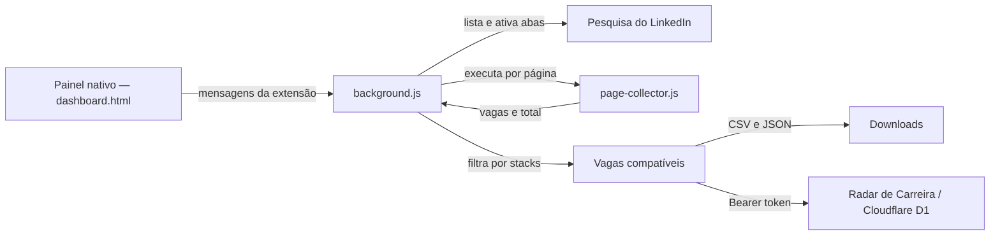

# Coletor de Vagas do LinkedIn

Extensão para Google Chrome com painel próprio que coleta vagas visíveis em pesquisas do LinkedIn, percorre todas as páginas encontradas, remove duplicidades e exporta os resultados consolidados em CSV e JSON. A versão 2 não exige Python, servidor local nem Console do navegador.

Versão atual da extensão: **2.2.0**.

> Este é um projeto independente. Não é afiliado, patrocinado nem mantido pelo LinkedIn.

## O que o projeto faz

- Detecta as pesquisas de vagas do LinkedIn abertas no Chrome.
- Mostra o total de resultados de cada pesquisa para evitar escolher a aba errada.
- Trabalha diretamente na aba selecionada, preservando filtros mantidos internamente pelo LinkedIn.
- Lê o total apresentado na página, como `212 resultados`.
- Calcula automaticamente o número de páginas considerando até 25 vagas por página.
- Percorre a paginação do próprio LinkedIn em sequência.
- Abre cada cartão para capturar a descrição da vaga.
- Remove vagas repetidas usando o link da vaga como identificador.
- Gera um único arquivo CSV e um único arquivo JSON por execução.
- Exibe o progresso em um painel azul e a conclusão em um painel verde.
- Não solicita nem armazena usuário, senha, cookies ou token do LinkedIn.
- Filtra vagas por stacks selecionadas e termos personalizados.
- Salva CSV e JSON em uma subpasta configurável de Downloads.
- Pode enviar as vagas compatíveis diretamente ao Radar de Carreira.

## Início rápido

### Requisitos

- Google Chrome ou navegador compatível com extensões Manifest V3.
- Conta do LinkedIn já autenticada no navegador.
- Windows, macOS ou Linux.

### 1. Baixar o projeto

Com Git:

```bash
git clone https://github.com/al-ramos/linkedin-job-collector.git
cd linkedin-job-collector
```

Também é possível usar **Code → Download ZIP** no GitHub e extrair o arquivo.

### 2. Instalar a extensão no Chrome

1. Abra `chrome://extensions`.
2. Ative **Modo do desenvolvedor**, no canto superior direito.
3. Clique em **Carregar sem compactação**.
4. Selecione somente a pasta `extensao-linkedin`.
5. Confirme que aparece **Coletor de Vagas do LinkedIn 2.2.0**.
6. Opcionalmente, fixe a extensão no menu de extensões do Chrome.

Não selecione a raiz inteira do projeto; o arquivo `manifest.json` está dentro de `extensao-linkedin`.

### Assistente de instalação no Windows

O script `instalar-no-chrome.ps1` abre a página de extensões, mostra a pasta correta e copia seu caminho. Execute com o botão direito **Executar com PowerShell** ou pelo terminal:

```powershell
powershell -ExecutionPolicy Bypass -File .\instalar-no-chrome.ps1
```

Por segurança, o Chrome sempre exige a confirmação final em **Carregar sem compactação**. Nenhum script local pode ignorar essa proteção.

### 3. Abrir o painel

1. Clique no ícone da extensão.
2. Clique em **Abrir painel completo**.

O painel abre em uma página interna da própria extensão. Não é necessário iniciar servidor, instalar dependências ou manter um terminal aberto.

## Uso recomendado: painel da extensão

### Preparar a pesquisa

1. Entre no LinkedIn.
2. Abra a página de pesquisa de vagas.
3. Configure os filtros desejados: palavra-chave, localização, modalidade, experiência, período, candidatura simplificada e outros filtros disponíveis.
4. Mantenha essa aba aberta.
5. Se desejar coletar pesquisas diferentes, mantenha cada pesquisa em uma aba separada.

### Selecionar e coletar

1. Clique no ícone da extensão e em **Abrir painel completo**.
2. Clique em **Atualizar lista**.
3. Em **Pesquisas abertas detectadas**, escolha a opção pelo total exibido, por exemplo `212 resultados`.
4. Deixe **Link da busca do LinkedIn** vazio quando usar uma pesquisa detectada.
5. Clique em **Iniciar coleta automática**.
6. A extensão ativará a própria aba escolhida, sem recriar a busca.
7. Não altere filtros, troque a paginação nem feche a aba durante a coleta.
8. Aguarde o painel verde com a mensagem de conclusão.

O campo de link é opcional. Quando preenchido, ele substitui a pesquisa selecionada na lista e abre a URL informada. A seleção de uma aba aberta é preferível porque alguns filtros do LinkedIn podem permanecer no estado interno da página e não ser reproduzidos perfeitamente ao reabrir somente a URL.

### Filtrar por stacks

1. Marque uma ou mais tecnologias em **Stacks aceitas**.
2. Adicione termos específicos separados por vírgula quando necessário.
3. Salve os parâmetros.

A correspondência usa o título e a descrição da vaga. Uma vaga é mantida quando corresponde a pelo menos uma stack marcada ou termo adicional. Se nenhuma opção for marcada e nenhum termo for informado, todas as vagas são mantidas. As stacks detectadas também são gravadas no CSV, JSON e Radar.

### Configurar os destinos

- **Baixar CSV e JSON** grava os arquivos na subpasta indicada dentro da pasta Downloads do Chrome.
- **Enviar ao Radar de Carreira** envia somente as vagas compatíveis ao endpoint configurado.
- É possível ativar os dois destinos ao mesmo tempo.

Por segurança, extensões do Chrome não podem gravar silenciosamente em um caminho absoluto arbitrário. O parâmetro local é uma subpasta relativa a Downloads, como `RadarCarreira` ou `Vagas/Java`.

Para integrar ao portal, use o endpoint:

```text
https://radar-carreira-almir-v2.prof-andreiamr.chatgpt.site/api/collector/import
```

Entre como administrador no Radar, abra **Extensão LinkedIn**, clique em **Gerar chave**, depois em **Salvar** e **Copiar**. Cole essa chave no painel da extensão e clique em **Testar conexão**. O Radar armazena somente o hash da chave; a extensão salva o texto apenas em `chrome.storage.local` no perfil atual do navegador.

## Como a paginação funciona

O LinkedIn normalmente apresenta até 25 vagas por página. O coletor lê o total de resultados e calcula:

```text
total de páginas = arredondar para cima(total de resultados ÷ 25)
```

Exemplo para 212 resultados:

```text
212 ÷ 25 = 8,48
Total calculado: 9 páginas
```

As oito primeiras páginas podem conter 25 vagas e a última, até 12. A rotina também para antecipadamente quando uma página não contém vagas ou não acrescenta nenhum link novo. Isso evita ciclos caso o LinkedIn repita resultados ou altere a paginação.

O total exportado pode ser menor que o total anunciado pelo LinkedIn quando:

- a mesma vaga aparece mais de uma vez;
- uma vaga expira ou é removida durante a execução;
- o LinkedIn limita ou reorganiza os resultados;
- algum cartão não está mais disponível para a conta autenticada.

## Arquivos exportados

Os arquivos são salvos na subpasta configurada dentro de Downloads:

```text
RadarCarreira/vagas-linkedin-AAAA-MM-DD.csv
RadarCarreira/vagas-linkedin-AAAA-MM-DD.json
```

### Colunas e propriedades

| Campo | Descrição |
|---|---|
| `titulo` | Título da vaga |
| `empresa` | Nome da empresa |
| `local` | Localização e informações resumidas exibidas no topo |
| `descricao` | Texto completo da descrição disponível na página |
| `stack` | Stacks detectadas no título e na descrição |
| `link` | URL canônica da vaga |
| `coletado_em` | Data e hora da coleta em formato ISO 8601 |
| `pagina` | Página da pesquisa em que a vaga foi encontrada |

O CSV usa ponto e vírgula como separador, inclui BOM UTF-8 e foi preparado para abertura no Excel em português. O JSON mantém a mesma informação em uma lista de objetos.

## Outros modos de uso

### Popup da extensão

Ao clicar no ícone da extensão, existem três opções:

- **Abrir painel completo**: abre o Organizador nativo da extensão.
- **Coletar somente esta página**: executa o coletor rápido na aba atual do LinkedIn.
- **Abrir LinkedIn Vagas**: abre uma nova pesquisa de vagas.

Para seleção clara entre várias pesquisas e paginação consolidada, use **Abrir painel completo**.

### Coletor manual

O arquivo `linkedin-coletor.js` preserva o coletor manual usado nas primeiras versões. O script pode ser copiado e executado no Console do Chrome em uma página de busca do LinkedIn. O painel automático atual é `extensao-linkedin/dashboard.html`.

Esse modo é apenas uma alternativa de recuperação. O fluxo pela extensão evita a proteção de colagem do DevTools e é o modo recomendado.

## Atualizar a extensão após mudanças

Como a extensão é instalada sem compactação, alterações locais não são carregadas automaticamente:

1. Abra `chrome://extensions`.
2. Localize **Coletor de Vagas do LinkedIn**.
3. Clique no ícone **Recarregar**.
4. Confirme a versão exibida.
5. Atualize com `Ctrl + R` as abas do LinkedIn já abertas.
6. Feche e abra novamente o painel completo.

O recarregamento das páginas garante que os scripts atualizados sejam usados na próxima execução.

## Permissões da extensão

O arquivo `manifest.json` declara:

| Permissão | Finalidade |
|---|---|
| `activeTab` | Trabalhar na aba escolhida pelo usuário |
| `scripting` | Executar os coletores nas páginas autorizadas |
| `tabs` | Listar pesquisas abertas, ativar a aba selecionada e acompanhar a navegação |
| `storage` | Salvar stacks, destinos, pasta, endpoint e chave no perfil local do Chrome |
| `downloads` | Gravar CSV e JSON na subpasta configurada sem perguntar a cada execução |
| `https://www.linkedin.com/*` | Ler somente páginas do LinkedIn necessárias à coleta |
| `https://radar-carreira-almir-v2.prof-andreiamr.chatgpt.site/*` | Enviar vagas ao portal somente quando essa opção estiver ativada |

## Privacidade e segurança

- O processamento acontece localmente no navegador.
- Por padrão, os dados permanecem locais. Quando **Enviar ao Radar** estiver ativado, somente as vagas filtradas são enviadas ao endpoint indicado.
- Não há backend, banco de dados, telemetria ou analytics.
- A extensão não lê nem armazena senhas.
- A extensão usa somente o conteúdo que a sessão autenticada já pode visualizar.
- Os arquivos são gerados no próprio navegador e enviados diretamente para a subpasta de Downloads.
- O projeto não tenta contornar CAPTCHA, autenticação, bloqueios ou controles de acesso.

Revise o código antes de instalar extensões locais. O projeto é público justamente para permitir auditoria.

## Solução de problemas

### A lista fica em “Procurando abas do LinkedIn”

1. Confirme que a extensão está ativada em `chrome://extensions`.
2. Clique em **Recarregar** no cartão da extensão.
3. Atualize com `Ctrl + R` todas as abas de pesquisa do LinkedIn.
4. Atualize o Organizador.
5. Clique novamente em **Atualizar lista**.

### A pesquisa desejada não aparece na lista

- Confirme que a URL começa com `https://www.linkedin.com/jobs/search/`.
- Mantenha a aba aberta e totalmente carregada.
- Atualize a aba do LinkedIn e depois a lista do Organizador.

### A rotina escolhe a pesquisa errada

- Não dependa apenas da ordem das abas.
- Escolha explicitamente a opção pelo total de resultados.
- Deixe o campo de link vazio para preservar o estado interno da aba selecionada.

### Ao informar um link, os filtros mudam

Alguns filtros podem estar somente no estado interno do aplicativo do LinkedIn. Abra e configure a pesquisa manualmente, deixe a aba aberta e selecione-a em **Pesquisas abertas detectadas**.

### Apenas 25 vagas são coletadas

- Use o painel completo, não apenas a coleta rápida do popup.
- Confirme que o total de resultados foi identificado na primeira página.
- Observe se os botões numéricos ou o botão de próxima página estão disponíveis no LinkedIn.

### A coleta para antes do total esperado

A rotina encerra quando não encontra vagas ou links novos. Isso pode acontecer por duplicidades, resultados removidos, alterações no layout, limitação temporária ou carregamento incompleto do LinkedIn.

### O segundo download não acontece

O Chrome pode bloquear múltiplos downloads. Quando solicitado, permita múltiplos downloads para `linkedin.com`. Verifique também a configuração de downloads do navegador.

### O envio ao Radar retorna 401

- Gere uma nova chave em **Radar → Extensão LinkedIn**, salve-a e copie-a novamente para o painel da extensão.
- Clique em **Testar conexão** antes de iniciar uma coleta completa.
- Não inclua `Bearer` no campo; a extensão adiciona esse prefixo automaticamente.

### Nenhuma vaga corresponde às stacks

- Revise as stacks marcadas e os termos adicionais.
- A correspondência considera título e descrição completa.
- Desmarque todas as stacks e apague termos adicionais para importar tudo.

### O CSV abre em uma única coluna

Importe o arquivo no Excel escolhendo:

- codificação UTF-8;
- delimitador ponto e vírgula;
- qualificador de texto aspas duplas.

### O painel azul não aparece

- Recarregue a extensão.
- Atualize a página do LinkedIn.
- Confirme que a página é uma busca de vagas e que a sessão está autenticada.
- Mudanças no HTML do LinkedIn podem exigir atualização dos seletores.

### Filtro do perfil no Radar

Quando **Enviar ao Radar** está ativo, a extensão envia as vagas compatíveis com
os filtros locais usando a chave do coletor. O portal também aplica o perfil de
stacks obrigatórias salvo na conta: o painel azul informa quantas vagas foram
aceitas e rejeitadas pelo perfil. A configuração de stacks no portal é a regra
final para o banco; a extensão não substitui essa validação.

## Arquitetura



### Responsabilidade dos arquivos

| Arquivo | Responsabilidade |
|---|---|
| `extensao-linkedin/manifest.json` | Manifesto, permissões e versão da extensão |
| `extensao-linkedin/dashboard.html` | Interface principal e seleção das pesquisas |
| `extensao-linkedin/dashboard.js` | Comunicação direta do painel com o service worker |
| `extensao-linkedin/dashboard.css` | Estilos do painel completo |
| `extensao-linkedin/stacks.js` | Catálogo de stacks e termos reconhecidos |
| `extensao-linkedin/background.js` | Orquestra abas, paginação, deduplicação e exportação consolidada |
| `extensao-linkedin/page-collector.js` | Lê o total e coleta os cartões de uma página |
| `extensao-linkedin/collector.js` | Coletor independente usado pelo popup |
| `extensao-linkedin/popup.html` | Interface do popup da extensão |
| `extensao-linkedin/popup.js` | Ações rápidas do popup |
| `extensao-linkedin/popup.css` | Estilos do popup |
| `linkedin-coletor.js` | Alternativa manual executável no Console |
| `instalar-no-chrome.ps1` | Assistente de instalação para Windows |

## Fluxo interno da coleta

1. O painel solicita à extensão a lista de abas em `/jobs/search/`.
2. A extensão lê o total visível de cada aba e devolve as opções.
3. O usuário seleciona a pesquisa pelo total de resultados.
4. O painel envia o identificador da aba, a URL e o rótulo selecionado.
5. O service worker ativa exatamente essa aba.
6. `page-collector.js` lê o total, carrega os cartões e coleta os campos.
7. O orquestrador calcula `ceil(total / 25)`.
8. Nas páginas seguintes, clica na paginação do próprio LinkedIn para preservar os filtros.
9. Os resultados são deduplicados pelo campo `link`.
10. O service worker identifica stacks e aplica os filtros salvos.
11. Os destinos habilitados recebem somente as vagas compatíveis.

## Desenvolvimento

O projeto usa JavaScript, HTML e CSS puros, sem processo de build e sem dependências npm.

Validações rápidas:

```bash
node --check extensao-linkedin/background.js
node --check extensao-linkedin/collector.js
node --check extensao-linkedin/page-collector.js
node --check extensao-linkedin/popup.js
node --check extensao-linkedin/dashboard.js
```

Após modificar arquivos da extensão, aumente a versão em `extensao-linkedin/manifest.json`, recarregue a extensão e repita um teste com uma pesquisa de mais de 25 resultados.

## Limitações conhecidas

- O LinkedIn pode alterar classes, estrutura, paginação e comportamento sem aviso.
- A coleta depende da sessão autenticada e do conteúdo disponibilizado para a conta.
- A execução é sequencial e pode levar vários minutos em pesquisas grandes.
- Não há execução totalmente desacompanhada, agendamento ou funcionamento com o Chrome fechado.
- O projeto não envia candidaturas e não modifica vagas salvas.
- Resultados dinâmicos podem mudar enquanto a coleta está em andamento.
- O modo multipágina depende dos controles de paginação visíveis do LinkedIn.

## Uso responsável

Use a ferramenta somente em conteúdo que você tem autorização para visualizar. Respeite os termos aplicáveis, a privacidade de terceiros, limites da plataforma e a legislação da sua jurisdição. Evite execuções excessivas ou simultâneas.

## Contribuição

1. Crie um fork do repositório.
2. Abra uma branch para a mudança.
3. Atualize a documentação e a versão do manifesto quando necessário.
4. Execute as validações de sintaxe.
5. Teste o fluxo manual, o popup e a coleta multipágina.
6. Abra um pull request descrevendo o cenário testado e o resultado.

Ao reportar um problema, inclua a versão da extensão, o navegador, o sistema operacional, o total de resultados mostrado e a etapa em que a execução parou. Não publique cookies, credenciais ou informações pessoais.
